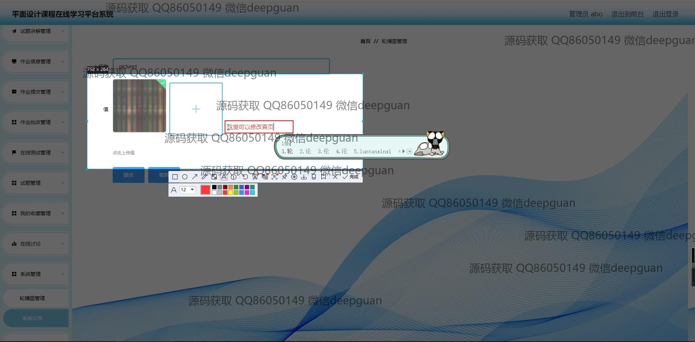
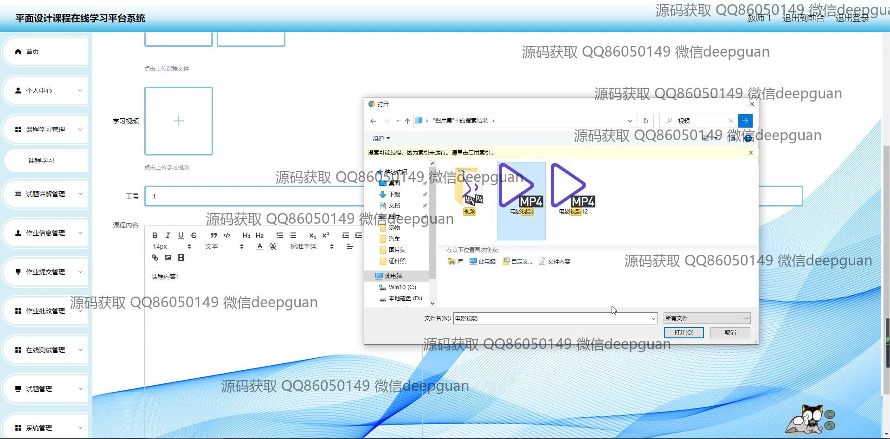
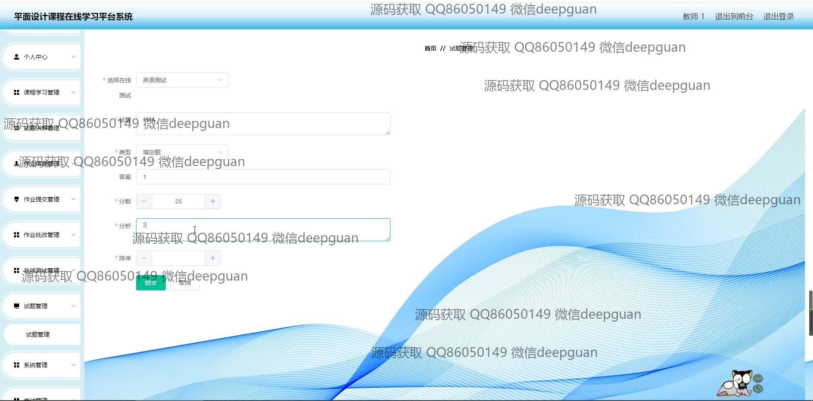
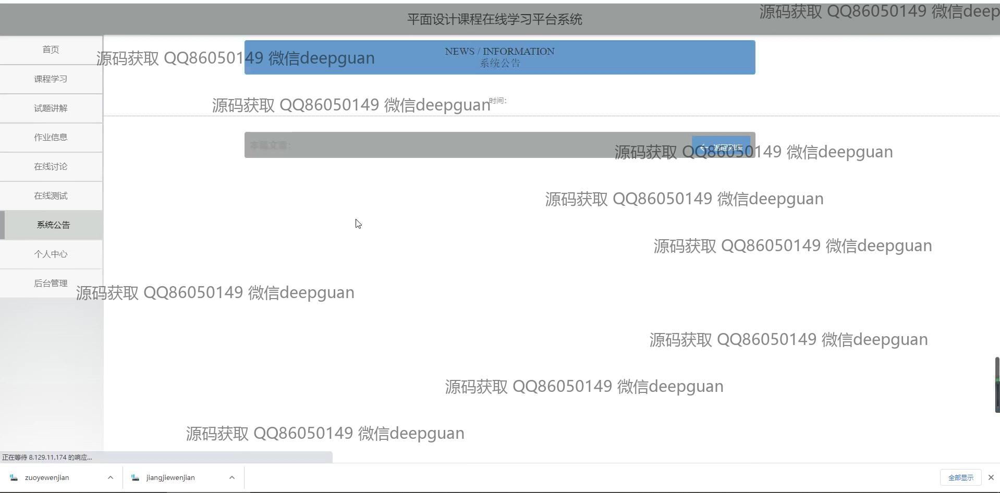
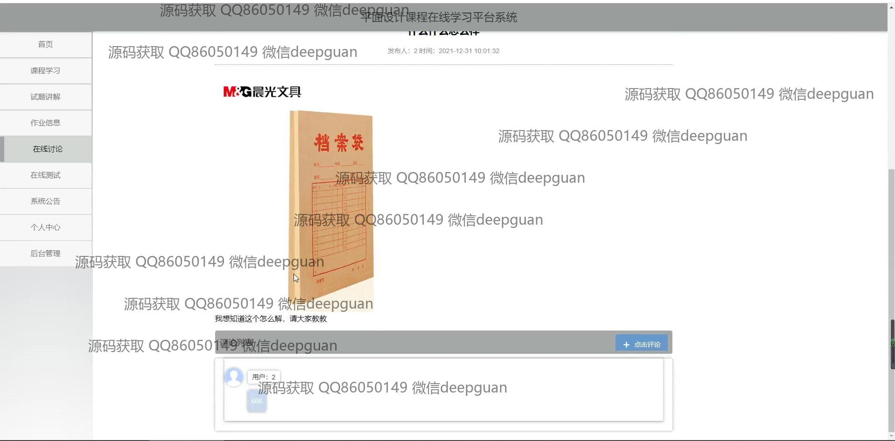
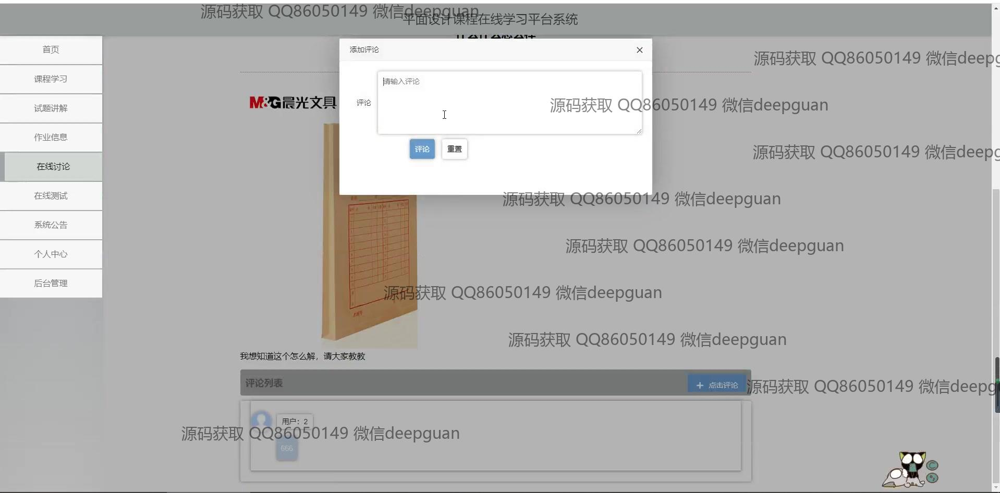

<h1 align="center">平面设计课程在线学习平台系统</h1>

## 简介
平面设计课程在线学习平台系统：用户可访问课程学习、试题讲解、作业管理、在线讨论、考试记录等模块；支持注册登录、提交作业、上传视频、查看公告和管理个人信息。    --计算机毕业设计源码；毕设源码；java毕业设计源码

## 联系方式

<h3 align="center">获取完整代码与数据库文件 + 微信：deepguan QQ: 86050149 QQ群: 783742310</h3>

<h3 align="center">可帮忙远程部署 包运行成功！提供远程部署、修改代码、设计文档指导、代码讲解等服务！</h3>

## 功能介绍（完整见运行截图）
管理员：基本功能包括登录、注册和退出。平台首页设有主导航栏，用户可以在后台管理系统中管理学生、教师的信息，并查看系统公告。还有试题、作业、课程信息和考试记录的管理功能，可以创建、修改和删除内容。作业模块允许作业提交和批改，并支持多媒体资料的上传和下载。

教师：具备注册、登录和修改个人信息的功能。在课程学习模块中，教师可以上传和管理课程内容及学习资源，提供作业和考试的布置与批改功能。可通过平台监控学生的学习进度，参与在线讨论，并在教师管理页面中查看和更新个人授课信息与班级情况。

学生：可通过注册与登录功能进入系统，个人中心提供个人信息查看与修改。学习平台允许访问课程学习资源，提交作业，以及参与在线讨论和在线测试。学生可以查看自己的考试记录与作业批改结果，使用搜索功能查找课程和试题信息，以及查看平台系统公告。

访客：可以通过平台了解课程的基本信息和功能模块，浏览导航栏中的课程学习、试题讲解、在线测试等内容。访客需注册成为学生或教师才可进行课程内容的具体操作，并参与作业提交和在线交互。

## 运行截图

本代码来源于网络,仅供学习参考使用!

